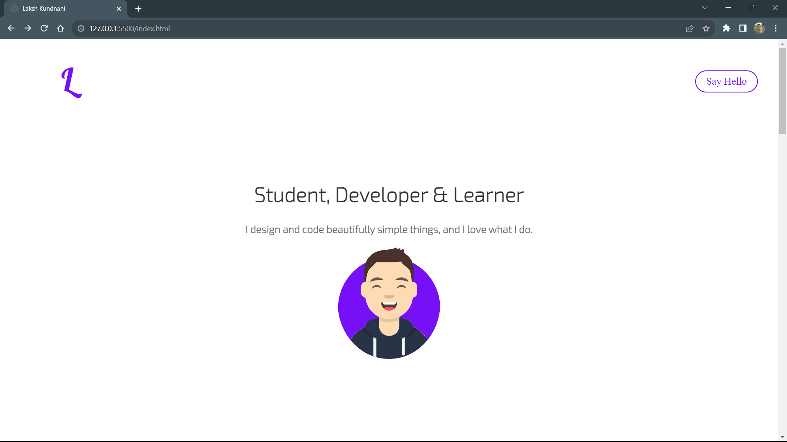

# Laksh Kundnani - Portfolio Website

Welcome to my portfolio website! This repository contains the source code for my personal portfolio website showcasing my skills, projects, and more.

## Table of Contents

- [Introduction](#introduction)
- [Features](#features)
- [Technologies](#technologies)
- [Projects](#projects)
- [Contact](#contact)
- [License](#license)

## Introduction

This portfolio website serves as a showcase of my work, skills, and experience. I'm a student, developer, and learner passionate about creating innovative solutions and improving my skills in various domains of technology.

Visit the live website: [https://www.example.com](https://www.example.com)

## Features

- **About Me**: Learn about my background, interests, and goals.
- **Skills**: Explore the programming languages and technologies I specialize in.
- **Projects**: Discover my recent projects, their descriptions, and source code links.
- **Contact**: Get in touch with me through various social media platforms.

## Technologies

The website is built using the following technologies:

- HTML, CSS, JavaScript
- [GSAP Animation Library](https://greensock.com/gsap/)
- [Font Awesome Icons](https://fontawesome.com/)
- GitHub Pages (for deployment)

## Projects

Here are some of the projects featured on my portfolio:

1. **Library Management System**
   - Description: Seamlessly organize and track books, streamline operations, and empower users with convenient book management tools.
   - Source Code: [GitHub Repository](https://github.com/kundnanl/Library-Management-System.git)

2. **Uno Game Clone**
   - Description: Experience the thrill of the beloved Uno card game brought to life with stunning visuals and smooth gameplay.
   - Source Code: [GitHub Repository](https://github.com/kundnanl/Uno-Game-Project.git)

3. **Banking System**
   - Description: Modern banking system with a robust frontend and secure backend, delivering a seamless banking experience.
   - Source Code: [GitHub Repository](https://github.com/kundnanl/Bank-Management-System.git)

Feel free to explore these projects in more detail!

## Contact

Connect with me on various platforms:

- [LinkedIn](https://www.linkedin.com/in/lakshkundnani/)
- [Dev.to](https://dev.to/kundnanl)
- [Instagram](https://www.instagram.com/lakshkundnanii)
- [GitHub](https://www.github.com/kundnanl)
